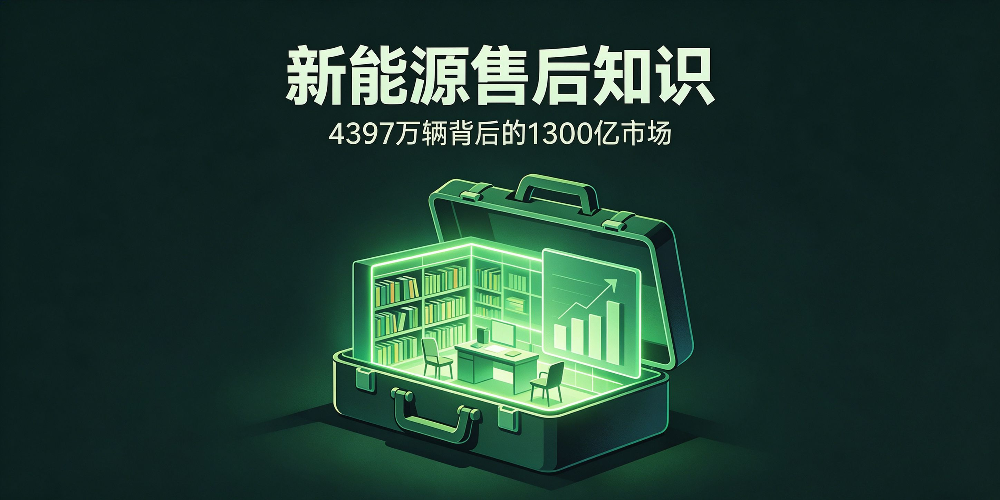

<div align="center">

# 新能源售后知识管理

**4397 万辆保有量背后：三电维修市场、培训体系、知识库搭建、AI 落地路径。**


[它解决什么问题](#它解决什么问题) - [为什么比手动强](#为什么比手动强) - [工作流](#工作流) - [实测参数](#实测参数) - [快速开始](#快速开始)

</div>

---

## 它解决什么问题

新能源售后正进入出保潮，但独立维修店"不能修、不敢修、不会修"：懂三电的技师稀缺、主机厂垄断数据和配件、知识库零散。这个仓库把市场数据、主机厂培训体系、知识库搭建五步法和 AI 落地路径整理成一套可迁移的方法论。

## 为什么比手动强

| 凭经验判断 | 本仓库 |
|---|---|
| 只知道新能源车火 | 4397 万辆保有量、1300 亿/年维保市场、人才缺口 80-103 万 |
| 培训体系照搬燃油车 | 套用理想"扬帆计划"四维架构迁移到售后 |
| 知识库从零摸索 | 五步搭建：文档化→冷启动→AI 拦截→转人工→迭代 |
| 不知 AI 能落在哪 | 人才发展智能体三阶段 + n8n/Dify/DeepSeek 轻量闭环 |

## 工作流

```
市场与出保潮判断（保有量 / 维保规模 / 出保节点）
   ↓
培训体系对标（蔚来 100% 覆盖 / 理想四维 / 赛力斯华为认证）
   ↓
知识库搭建五步法
   ↓
AI 落地（技能评估 → 培训推荐 → 职业路径）
```

## 实测参数

- **保有量**：4397 万辆（2025 年底），2025 新注册 1293 万辆（占 49.38%）
- **出保潮**：2030 年超 900 万辆脱保，2032 年突破 2000 万辆
- **供给侧**：约 40 万家汽修企业，具三电能力仅 2-3 万家（<3%），胜任电池检测人员约 25%
- **人才缺口**：80-103 万，双证技师持有率 <20%，智能驾驶工程师供需比 0.38
- **培训基准**：蔚来人均约 50 小时/年、覆盖率 100%

## 快速开始

```text
1. 用市场数据判断方向：出保潮 + 供给不足 = 三电维修人才缺口近百万
2. 直接套用培训四维架构：新员工 / 通用力 / 专业力（三电）/ 管理能力
3. 知识库五步：文档知识化 → 3 天冷启动 → 80%+ 简单问题 AI 拦截 → 复杂转人工 → 数据驱动 SOP 迭代
4. 轻量 AI 闭环：n8n 流程自动化 + Dify 培训问答 + DeepSeek 推理
```

## License

MIT
